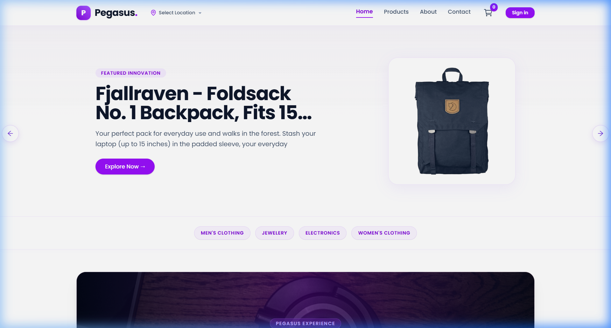

# Pegasus 🛍️✨
> **Elevate Your Shopping Experience.** A sleek, minimalist e-commerce web application designed with modern purple and white aesthetics, built with React 19, Tailwind CSS v4, Vite, and Clerk Authentication.

---



---

## 🌟 Overview

**Pegasus** is a modern e-commerce storefront that marries high performance with a refined **purple and white minimalist design**. Built for seamless browsing, it features smooth carousel transitions, instant dynamic filtering, geolocation detection, responsive mobile drawers, and secure user authentication.

---

## ✨ Features

- **🎨 Minimalist Purple & White Aesthetic**
  - Curated purple color system (`#7c3aed`, `#6d28d9`, `#ede9fe`, `#f5f3ff`).
  - Crisp white surfaces with subtle border highlights and soft drop shadows.
  - Premium typography powered by `@fontsource/poppins`.
- **🔐 Clerk Authentication**
  - Seamless user sign-in and account management powered by `@clerk/clerk-react`.
  - Protected checkout and user-personalized cart experiences.
- **🎠 Interactive Hero Showcase**
  - Autoplay hero slider using `react-slick` with custom circular arrow controls.
  - Highlights featured innovations with smooth hover transitions.
- **🏷️ Category & Brand Navigation**
  - Quick-access pill navigation for product categories.
  - Comprehensive multi-attribute filtering (Search, Category, Brand, Price Slider).
- **⚡ Sorting & Pagination**
  - Real-time client-side sorting (Featured, Price: Low to High, Price: High to Low, Alphabetical).
  - Clean paginated product listing with responsive grid layouts.
- **📍 Geolocation Detection**
  - Integrated OpenStreetMap reverse geocoding to auto-detect and populate user delivery location.
- **🛒 Persistent Shopping Cart**
  - LocalStorage-backed cart state with quantity increment/decrement, item deletion, and live price/tax breakdown.
  - Visual empty-cart state with animated calls-to-action.
- **📱 100% Mobile Responsive**
  - Custom sliding hamburger drawer menu.
  - Dedicated mobile filter dropdown modal.

---

## 🛠️ Tech Stack

| Technology | Purpose |
| :--- | :--- |
| **[React 19](https://react.dev/)** | Core UI library & component architecture |
| **[Vite](https://vitejs.dev/)** | Next-generation frontend build tool |
| **[Tailwind CSS v4](https://tailwindcss.com/)** | Utility-first modern CSS framework |
| **[Clerk](https://clerk.com/)** | User authentication & account management |
| **[React Router v7](https://reactrouter.com/)** | Client-side routing & navigation |
| **[Axios](https://axios-http.com/)** | HTTP client for REST API communication |
| **[React Slick](https://react-slick.neostack.com/)** | Carousel slider for hero banners |
| **[Lucide React](https://lucide.dev/) & [React Icons](https://react-icons.github.io/react-icons/)** | Modern vector iconography |
| **[Lottie React](https://github.com/Gamote/lottie-react)** | Lightweight animations for empty & loading states |
| **[Poppins Font](https://fontsource.org/fonts/poppins)** | Clean, geometric sans-serif typography |

---

## 📁 Project Structure

```bash
ecommerce-app/
├── public/                 # Static public assets
├── screenshots/            # UI preview captures for documentation
│   ├── hero-preview.png    # Homepage hero showcase
│   └── products-preview.png# Product grid & filter preview
├── src/
│   ├── assets/             # Images, video loaders, and Lottie animations
│   ├── components/         # Modular reusable UI components
│   │   ├── Breadcrums.jsx      # Route breadcrumb trail
│   │   ├── Carousel.jsx        # Hero carousel slider
│   │   ├── Category.jsx        # Pill-based category navigation
│   │   ├── Features.jsx        # Value proposition feature grid
│   │   ├── FilterSection.jsx   # Desktop sidebar filters
│   │   ├── Footer.jsx          # Minimalist purple & white footer
│   │   ├── MidBanner.jsx       # Parallax-style promotional banner
│   │   ├── MobileFilter.jsx    # Collapsible mobile filter panel
│   │   ├── Navbar.jsx          # Sticky header with logo, search, and cart
│   │   ├── Pagination.jsx      # Dynamic page number pagination
│   │   ├── ProductCard.jsx     # Individual product showcase card
│   │   ├── ProductListView.jsx # Detailed horizontal product item
│   │   ├── ProtectedRoute.jsx  # Route guard for authenticated paths
│   │   └── ResponsiveMenu.jsx  # Mobile slide-out drawer
│   ├── context/            # React Context providers
│   │   ├── CartContext.jsx     # Cart state, quantities & calculations
│   │   └── DataContext.jsx     # Product fetching, categories & brands
│   ├── pages/              # Primary route views
│   │   ├── About.jsx           # Brand story and mission
│   │   ├── Cart.jsx            # Shopping bag and delivery form
│   │   ├── CategoryProduct.jsx # Products filtered by specific category
│   │   ├── Contact.jsx         # Support concierge and contact form
│   │   ├── Home.jsx            # Landing page layout
│   │   ├── Products.jsx        # Full product catalog view
│   │   └── SingleProduct.jsx   # Product detail page
│   ├── App.jsx             # Route definitions and layout wrapper
│   ├── index.css           # Tailwind CSS imports and global design tokens
│   └── main.jsx            # App root, Clerk provider & toast provider
├── index.html              # HTML5 entry point
├── package.json            # Project dependencies & scripts
└── vite.config.js          # Vite configuration
```

---

## 🚀 Getting Started

### Prerequisites

Ensure you have the following installed on your machine:
- **Node.js**: `v18.0.0` or higher
- **npm** or **yarn**

### 1. Clone the Repository

```bash
git clone https://github.com/DineshPabboju/E-Commerce-App.git
cd E-Commerce-App
```

### 2. Install Dependencies

```bash
npm install
```

### 3. Setup Environment Variables

Create a `.env` file in the root directory:

```env
VITE_CLERK_PUBLISHABLE_KEY=your_clerk_publishable_key_here
```

> [!NOTE]
> Obtain your publishable key from your [Clerk Dashboard](https://dashboard.clerk.com/).

### 4. Run Development Server

```bash
npm run dev
```

Open your browser and navigate to:
```
http://localhost:5173
```

### 5. Build for Production

```bash
npm run build
```

To preview the production build locally:
```bash
npm run preview
```

---

## 🌐 External APIs Used

- **[Fake Store API](https://fakestoreapi.com/)**: Provides mock products, categories, descriptions, and ratings.
- **[OpenStreetMap Nominatim](https://nominatim.openstreetmap.org/)**: Reverse geocoding API utilized to translate GPS coordinates into readable city, state, and country addresses.

---

## 📄 License

This project is open source and available under the [MIT License](LICENSE).

---

<div align="center">
  <sub>Crafted with care for <strong>Pegasus</strong>. Minimalist Tech & Living.</sub>
</div>
